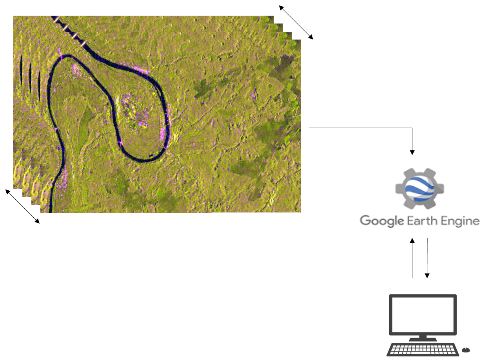

**Date: 2022-05-15**  
**Authors: Asifat Haruna Olawale**  
**email: olawaleasifat@gmail.com**  
**Copyright © 2022 Asifat Haruna. All rights reserved**  

**Large-Scale Preprocessing of Sentinel-1 (SAR) Data for Time Series Analysis**

This project demonstrates how to efficiently prepare a dense synthetic aperture radar (SAR) time series using the distributed cloud platform of Google Earth Engine.   

Google Earth Engine is a cloud-based geospatial analysis platform that allows researchers, scientists, and developers to access and analyze vast amounts of satellite imagery and geospatial data. It provides a wide array of tools and functions for processing, visualizing, and interpreting Earth observation data, enabling users to derive insights about land use, climate, ecosystems, and more. Google Earth Engine's integration of remote sensing data with computing power simplifies complex geospatial analysis tasks and promotes environmental monitoring and research on a global scale.

To access tutorials showcasing the practical use of Google Earth Engine for geospatial analysis and its capabilities in handling extensive remote sensing data, kindly explore the following link: 
https://developers.google.com/earth-engine/tutorials/tutorials

To view and execute this code online using the GEE code editor, simply click on the link provided below. However, in order to run this code on Google Earth Engine, it is necessary to have a Gmail account or to sign up for one.

https://code.earthengine.google.com/a055d4496cc69edd7ebf3819bc31bbac

